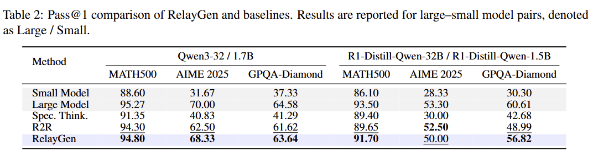
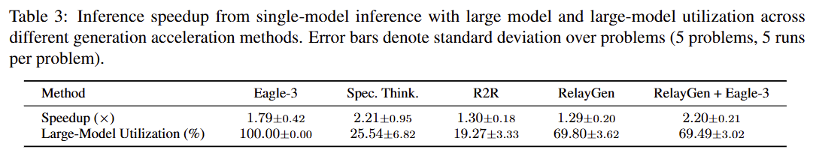

# RelayGen: Intra-Generation Model Switching for Efficient Reasoning

Official Implementation of "RelayGen: Intra-Generation Model Switching for Efficient Reasoning"

<p align="middle">
    <a href="https://arxiv.org/abs/2602.06454"></a>
</p>
<p align="middle">
    
</p>
<p align="middle">
    
</p>

**RelayGen** is a training-free, segment-level runtime model switching framework that exploits intra-generation difficulty variation to reduce inference latency while preserving most of the accuracy of large reasoning models.

- Intra-generation switching between small and large reasoning models to reduce compute while preserving reasoning quality.
- Model-adaptive discourse-level cue detection for model switching.
- Up to 2.20x training-free acceleration combined with Eagle-3 speculative decoding.

## Installation
```
pip install -r requirements.txt
```

## Quickstart
### Launch Engine
Lunch small model:
```
bash launch/qwen3_1.7b.sh
```

Launch large model:
```
bash launch/qwen3_32b.sh
```
or with Eagle-3:
```
bash launch/qwen3_32b_eagle3.sh
```


### Run RelayGen Inference
```
bash run/relaygen/aime25_qwen3_1.7b_32b.sh
```
or with Eagle-3:
```
bash run/relaygen/aime25_qwen3_1.7b_32b_eagle3.sh
```

## Results
<p align="middle">
    
</p>
<p align="middle">
    
</p>

- RelayGen preserves most of the accuracy of large reasoning models across benchmarks.
- RelayGen reduces end-to-end latency, and scales further with speculative decoding.

## Citation
```
@misc{relaygen,
      title={RelayGen: Intra-Generation Model Switching for Efficient Reasoning},
      author={Jiwon Song and Yoongon Kim and Jae-Joon Kim},
      year={2026},
      eprint={2602.06454},
      archivePrefix={arXiv},
      primaryClass={cs.CL},
      url={https://arxiv.org/abs/2602.06454},
}
```
